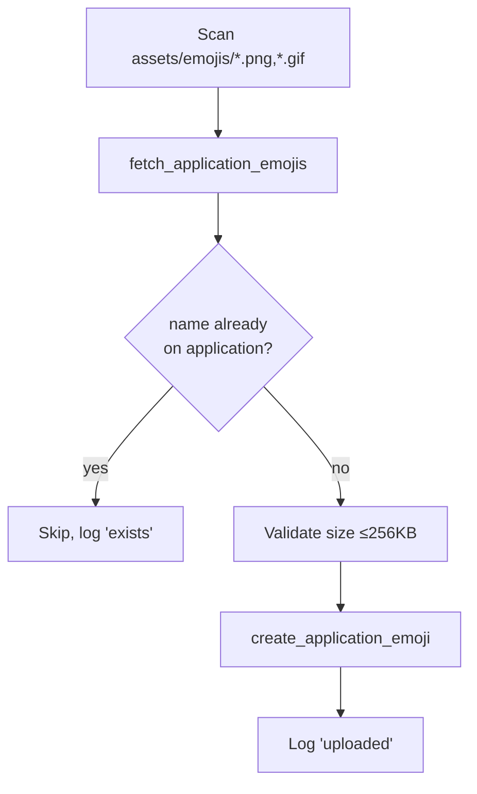
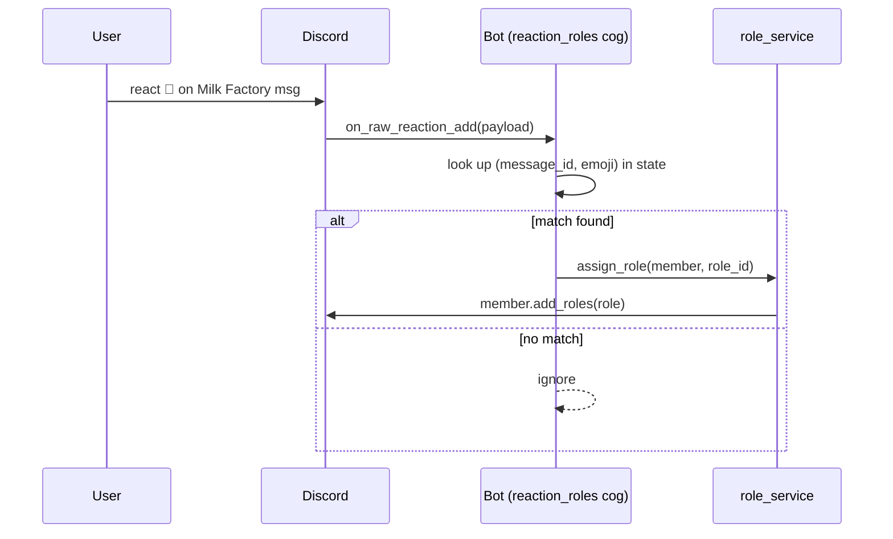

# Leaf Valley — Reaction Role Bot Plan

A Discord bot for a farming game community that assigns "item preparation" roles via
reaction roles. Each **factory** has its own message; each **item** the factory can
produce is a reaction (emoji) under that message. Reacting grants the matching role so
a task lead can `@ping` everyone who prepped a given item.

---

## 1. Goals & feature summary

| # | Feature | Priority |
|---|---------|----------|
| 1 | Reaction-role messages, one per factory, one emoji per item | Must-have |
| 2 | Add role on reaction-add, remove role on reaction-remove | Must-have |
| 3 | Admin command to **clear all item roles + user reactions** (weekly reset, keeps bot's seed reactions) | Must-have |
| 4 | Programmatically **create item roles** in the guild | Must-have |
| 5 | **Seed script** to upload custom emojis (application-owned) from a local folder (idempotent) | Nice-to-have |
| 6 | Command to (re)build/refresh factory messages from config | Must-have |
| 7 | Optional scheduled auto-reset (e.g. Monday 00:00) | Nice-to-have |

---

## 2. Key design decisions

### Reactions vs. buttons
You asked specifically for reactions, so the plan uses **raw reaction events**
(`on_raw_reaction_add` / `on_raw_reaction_remove`). These fire even for messages sent
before the bot restarted (unlike cached `on_reaction_add`), which is essential because
the factory messages are long-lived.

> Alternative worth knowing: Discord's newer **buttons / select menus** (persistent
> `discord.ui.View`) are the modern idiom and avoid emoji-management overhead. If you
> ever want a dropdown of items instead of reactions, the same service layer below can
> back it. Sticking with reactions for now, as requested.

### Reaction-remove behaviour
**Decided:** un-reacting immediately removes the role. This mirrors the mental model
("my reactions = what I'm prepping"), keeps the weekly reset as a safety net rather
than the only way to opt out, and lets users fix mistakes without pinging an admin.
Implementation: `on_raw_reaction_remove` → `role_service.remove_role` (see §7).

### Answering your API questions
- **Create roles programmatically?** Yes — `guild.create_role(name=..., mentionable=True, ...)`.
- **Upload emojis programmatically?** Yes — and we'll use **application-owned emojis**
  (`bot.create_application_emoji(name=..., image=<bytes>)`, added in discord.py 2.5)
  rather than guild-owned emojis. Application emojis are owned by the bot's application,
  work as reactions in any guild the bot is in, cap at **2000 per application** (vs. 50
  per guild), and require **no** "Manage Emojis" permission in the guild. Images still
  must be ≤ 256 KB. Run as a one-off **seed script**, not a weekly job (see §5a).
- **Won't re-running the seed script duplicate emojis?** It would if done naively —
  Discord does **not** enforce unique emoji names, so uploading `cheese` twice yields two
  emojis. The seed script avoids this by being **idempotent**: it fetches the
  application's existing emojis (`bot.fetch_application_emojis()`) first and uploads
  only names that are missing (see §5a).
- **Clear roles weekly?** Yes — a command iterates the managed roles and calls
  `member.remove_roles(role)` for each holder (or clears every member of each role via
  `role.members`).

### Persistence
Two kinds of state:
1. **Static definitions** (factories → items → emoji/role names): human-edited config
   file (`config/factories.yaml`). Source of truth, version-controlled.
2. **Runtime IDs** (created role IDs, uploaded emoji IDs, posted message IDs): written
   by the bot after setup into `data/state.json`. Needed to map a reaction on a specific
   message+emoji back to a role. Start with JSON; swap to SQLite later if it grows.

---

## 3. Tech stack

- **Runtime:** Python 3.13, managed with `uv`.
- **Library:** `discord.py` ≥ 2.5 (2.7.x is current; application-emoji APIs need 2.5+).
- **Config:** `PyYAML` for `factories.yaml`.
- **Env/secrets:** `python-dotenv` to load the bot token from `.env` (never commit it).
- **Logging:** stdlib `logging`.
- **Dev tooling (optional):** `ruff` (lint/format), `pytest` (tests).

Install:
```bash
uv add discord.py pyyaml python-dotenv
uv add --dev ruff pytest
```

Discord Developer Portal setup:
- Create the application + bot, copy the token into `.env`.
- Enable the **Server Members Intent** (needed to add/remove roles and enumerate members).
- Invite with scopes `bot` + `applications.commands` and permissions:
  Manage Roles, Read Messages, Add Reactions, Read Message History.
  (**No "Manage Emojis" needed** — application emojis are managed by the app itself, not
  by any guild.)
- The bot's own role must sit **above** every item role in the role hierarchy, or it
  cannot assign them.

---

## 4. Proposed file structure

```
leaf-valley/
├── pyproject.toml
├── README.md
├── .env                      # BOT_TOKEN=...  (git-ignored)
├── .env.example              # documents required vars
├── .gitignore
├── config/
│   └── factories.yaml        # source of truth: factories, items, emojis, role names
├── assets/
│   ├── emojis/               # PNG/GIF files; filename (sans ext) = emoji name
│   │   ├── cheese.png        #   -> uploaded as :cheese:
│   │   └── cream.png         #   -> uploaded as :cream:
│   └── factories/            # embed images; filename matches factory `key`
│       ├── milk_factory.png  #   -> shown in the Milk Factory embed
│       └── bakery.png
├── data/
│   └── state.json            # runtime IDs written by the bot (git-ignored)
├── docs/
│   └── PLAN.md               # this document
├── scripts/
│   └── seed_emojis.py        # standalone, idempotent emoji uploader (see §5a)
├── src/
│   └── leaf_valley/
│       ├── __init__.py       # exposes main()
│       ├── __main__.py       # `python -m leaf_valley` entry point
│       ├── bot.py            # LeafValleyBot(commands.Bot): intents, cog loading, on_ready
│       ├── settings.py       # loads env vars, paths, constants (token, guild id)
│       ├── logging_config.py # logging setup
│       ├── config/
│       │   ├── __init__.py
│       │   ├── schema.py     # dataclasses: Factory, Item, FactoryConfig
│       │   └── loader.py     # parse & validate factories.yaml
│       ├── storage/
│       │   ├── __init__.py
│       │   └── state_store.py # read/write data/state.json (message/role/emoji IDs)
│       ├── services/
│       │   ├── __init__.py
│       │   ├── role_service.py   # create roles, assign/remove, bulk clear
│       │   ├── emoji_service.py  # list/find/upload application emojis (idempotent)
│       │   └── factory_service.py# post/refresh factory messages + seed reactions
│       └── cogs/
│           ├── __init__.py
│           ├── reaction_roles.py # raw reaction listeners -> role_service
│           ├── setup.py          # /setup-factories, /create-roles
│           └── admin.py          # /clear-roles, /reset-week, optional scheduler
└── tests/
    ├── test_config_loader.py
    └── test_state_store.py
```

### Why this layout
- **`cogs/`** = Discord-facing layer (commands + event listeners). Thin; delegates logic.
- **`services/`** = pure-ish business logic against the Discord API, unit-testable and
  reusable across cogs (a reaction and a button can call the same `role_service`).
- **`config/`** = load + validate static definitions once, hand typed objects to services.
- **`storage/`** = the only place that touches `state.json`; isolates persistence.
- **`settings.py`** = single source for env/config; no scattered `os.getenv` calls.
- **`scripts/`** = one-off operational tasks run by hand (e.g. emoji seeding), kept out
  of the bot runtime. They reuse `services/` and `settings.py` so there's no logic copy.

---

## 5a. Emoji seed script (folder → application, idempotent)

Instead of a `/upload-emojis` command, drop image files into `assets/emojis/` and run a
standalone script that uploads them as **application-owned emojis**. The **filename
(without extension) is the emoji name** — `cheese.png` becomes `:cheese:`. This matches
the `emoji: ":cheese:"` references in `factories.yaml`.

### Why application emojis (not guild emojis)
- **2000 per application** cap vs. 50 per guild.
- **No "Manage Emojis" permission** needed in the guild.
- Works as a reaction in **any guild** the bot is in (relevant if you ever add a second
  server).
- Owned by the bot, so members can't accidentally delete them from server settings.

API (discord.py 2.5+):
- `await bot.create_application_emoji(name=..., image=<bytes>)`
- `await bot.fetch_application_emojis()` → `list[Emoji]`

### Avoiding duplicates on re-run
Discord does **not** enforce unique emoji names, so a naive re-run would upload copies.
The script is **idempotent** by name:



Algorithm:
1. Log in as the bot (no guild lookup required for this script).
2. Build a set of existing emoji names: `{e.name for e in await bot.fetch_application_emojis()}`.
3. For each file in `assets/emojis/`, derive `name = file.stem`.
4. If `name` is already in the set → **skip** (this is what prevents duplicates).
5. Else validate the file (≤ 256 KB, PNG/GIF/JPEG) and `create_application_emoji`.
6. Print a summary: uploaded / skipped / failed counts.

Run it with:
```bash
uv run python scripts/seed_emojis.py
```

Notes:
- **Renaming** an emoji: rename the file *and* update its reference in `factories.yaml`.
  The script won't rename existing emojis (it only adds missing ones) — add a
  `--prune`/`--sync` flag later if you want it to delete emojis no longer backed by a file.
- **Updating an image** under the same name: the script skips it (name exists). Delete
  the emoji via the Developer Portal or API (or add a `--force` flag) if you need to
  replace artwork.
- Keep it separate from the bot process so uploading never blocks the running bot.

---

## 5. Configuration format

`config/factories.yaml`:
```yaml
factories:
  - key: milk_factory
    name: "🐄 Milk Factory"
    channel_id: 123456789012345678   # where the message is posted
    image: "milk_factory.png"        # file in assets/factories/, shown in the embed
    items:
      - key: cheese
        role_name: "cheese"
        emoji: "🧀"                   # unicode emoji, OR
        # emoji: ":cheese_custom:"    # custom emoji name to upload/reference
      - key: cream
        role_name: "cream"
        emoji: "🥛"
  - key: bakery
    name: "🍞 Bakery"
    channel_id: 123456789012345679
    image: "bakery.png"
    items:
      - key: bread
        role_name: "bread"
        emoji: "🍞"
```

- `key` fields are stable internal IDs (safe to rename display `name`/`emoji` later).
- Custom emojis referenced by `:name:` are uploaded ahead of time by the seed script
  (§5a) as **application emojis**; `/setup-factories` resolves `:name:` via
  `bot.fetch_application_emojis()` when seeding reactions.

`data/state.json` (bot-managed):
```json
{
  "guild_id": 111,
  "factories": {
    "milk_factory": {
      "message_id": 222,
      "items": {
        "cheese": { "role_id": 333, "emoji_id": null },
        "cream":  { "role_id": 334, "emoji_id": null }
      }
    }
  }
}
```

---

## 5b. Factory message rendering (embeds + local images)

Each factory message is a **Discord embed** for a clean, recognisable card. The factory
image is a **local file attached to the message** — no external hosting, no dependency
on the Discord emoji system, and no re-upload needed because you're posting the messages
once.

Layout per embed:
- **Title:** factory `name` (e.g. "🐄 Milk Factory").
- **Image:** the factory's picture from `assets/factories/<image>`.
- **Description:** a legend mapping each reaction to its item, e.g.
  ```
  React with an emoji to prep that item this week:
  🧀 — cheese
  🥛 — cream
  ```
- **Colour:** optional accent per factory (add `color: "#f5c542"` to the config later if
  wanted).

Posting flow (`factory_service`):

The service exposes two small helpers that are composed by the two commands:

- `post_factory_message(channel, factory)` — build the embed + attachment and send it.
  Called only by `/setup-factories` (runs once ever).
- `seed_reactions(message, items)` — add each item's emoji to a message as a reaction.
  **Shared:** called by `/setup-factories` after posting *and* by `/reset-week` after
  `message.clear_reactions()`.

| Command | Composition |
|---|---|
| `/setup-factories` | `post_factory_message` → `seed_reactions` |
| `/reset-week` | `message.clear_reactions()` → `seed_reactions` (+ `role_service.clear_all`) |

`/setup-factories` per factory:
1. Build `discord.File(path=assets/factories/milk_factory.png, filename="milk_factory.png")`.
2. Build `discord.Embed(title=..., description=...)` and call
   `embed.set_image(url="attachment://milk_factory.png")` — this points the embed at the
   attached file without needing a public URL.
3. `await channel.send(embed=embed, file=file)`.
4. Call `seed_reactions(message, factory.items)` — unicode emoji directly, custom emoji
   by ID resolved from the guild.
5. Persist `message_id` in `state.json`.

Notes:
- **`image` is optional (`Optional[str]`).** Some factories have no artwork (e.g.
  `collection`, which isn't a real in-game building). When `image` is `null`, skip the
  `discord.File` attachment and the `embed.set_image()` call and post an embed with no
  picture — do **not** fall back to a `placeholder.png`, as opening a missing file raises
  `FileNotFoundError`. The config schema must type `image` as optional and `post_factory_message`
  must guard the attachment on it.
- **Local file vs. URL:** local attachment is chosen because you'll run setup once, and

  it avoids relying on an external image host that could go down or rate-limit. If you
  ever want to edit the picture without reposting, switch to `embed.set_image(url=<URL>)`
  and edit the embed in place.
- **Embed image size limits:** Discord accepts up to 8 MB per attachment on non-boosted
  servers; keep factory pictures well under that (a few hundred KB is plenty).
- **These images are unrelated to the emoji seed script** — `assets/emojis/` feeds
  guild custom emojis (used as reactions), while `assets/factories/` feeds embed images.

---

## 6. Command surface (slash commands, admin-only)

| Command | Purpose |
|---------|---------|
| `/create-roles` | Create any missing item roles (mentionable), store role IDs in state. |
| `/setup-factories` | Post/refresh one message per factory and seed its reactions; store message IDs. Idempotent. |
| `/reset-week` (a.k.a. `/clear-roles`) | Remove every managed item role from all members. Guarded by a confirmation prompt. |
| `/status` | Show mapping health: which factories/roles/messages are wired up (debugging aid). |

Restrict these to admins via `@app_commands.checks.has_permissions(manage_guild=True)`.

Custom-emoji upload is **not** a command — it's the `scripts/seed_emojis.py` seed script
(§5a). Typical first-run order: `uv run python scripts/seed_emojis.py` → `/create-roles`
→ `/setup-factories`.

---

## 7. Core flows

### Reaction add/remove

Removing the reaction triggers `on_raw_reaction_remove` → `role_service.remove_role`.

### Weekly reset
1. Admin runs `/reset-week`; bot replies with a confirm button.
2. On confirm, the reset does **two** things (both idempotent):
   - **Reset the reactions on every factory message** by calling
     `message.clear_reactions()` and then re-seeding the bot's reactions using the
     same helper `/setup-factories` uses. This wipes all user reactions in one call
     per message, then restores the "signup board" to its initial state. Chosen over
     per-user removal because it's simpler (reuses existing code), has a fixed cost
     (1 clear + N items per message), and fires a single `on_raw_reaction_clear`
     event instead of one `on_raw_reaction_remove` per user.
   - **Remove every managed item role from all members** via
     `role_service.clear_all(managed_role_ids)`, chunked to respect rate limits.
3. Bot reports counts (messages reset, roles cleared, members affected).
4. Optional: a `discord.ext.tasks` loop runs this automatically at a set weekday/time.

> Interaction with the reaction listeners: `clear_reactions()` fires a single
> `on_raw_reaction_clear` event (not per-user removes), so the `reaction_roles` cog
> just ignores that event — no "reset in progress" flag needed. The bot's own
> re-seeded reactions are ignored by the add listener as usual
> (`payload.user_id == bot.user.id`).

---

## 8. Reliability & edge cases to handle

- **Bot restart:** raw reaction events + IDs persisted in `state.json` mean mappings
  survive restarts; no need to re-post messages.
- **Manual reaction on wrong message / unknown emoji:** silently ignored.
- **Role hierarchy / missing permission:** catch `discord.Forbidden`, log a clear
  actionable message ("move the bot role above item roles").
- **Rate limits:** discord.py handles them, but batch the weekly clear and add small
  awaits to avoid hammering large member lists.
- **Ignore bot's own reactions** when seeding messages (`payload.user_id == bot.user.id`).
- **Idempotency:** `/create-roles`, `/setup-factories`, and the emoji seed script should
  no-op on existing roles/messages/emojis rather than duplicate them.
- **Emoji slot limits:** application emojis cap at 2000, so this is unlikely to bite,
  but the seed script should still fail gracefully if the API rejects an upload.
- **Seed emojis before setup:** custom emojis can only be added as reactions once they
  exist, so `scripts/seed_emojis.py` must run before `/setup-factories`.
  `/setup-factories` should fail loudly if a `:name:` referenced in `factories.yaml` is
  missing from the application's emojis (points you back to the seed step).
- **20-reactions-per-message limit:** Discord caps a message at 20 reactions, so a
  factory with >20 items must be split across multiple messages. `/setup-factories`
  should detect this and either paginate or error clearly.

---

## 9. Suggested build order (milestones)

1. **Skeleton:** `settings.py`, `bot.py`, `__main__.py`; bot logs in and syncs commands.
2. **Config layer:** `factories.yaml` + loader/schema + tests.
3. **State store:** JSON read/write + tests.
4. **Role service + `/create-roles`.**
5. **Factory service + `/setup-factories`** (post messages, seed reactions).
6. **Reaction roles cog** (add/remove listeners) — end-to-end reaction → role works.
7. **Admin `/reset-week`** with confirmation.
8. **Emoji seed script** `scripts/seed_emojis.py` + `emoji_service` (idempotent upload).
9. **Polish:** `/status`, optional scheduler, logging, README.

---

## 10. Open questions for you

1. Single guild/server, or should this support multiple servers? (Single is much simpler
   — the plan assumes single.)
2. Weekly reset: manual command only, or auto-scheduled (which day/time/timezone)?
3. Custom emojis: do you already have image files, or will you mostly use built-in
   unicode emoji? (Affects how soon you need the seed script.) Do you want a
   `--sync`/`--prune` flag to delete emojis whose file was removed?
4. Who can run admin commands — anyone with Manage Server, or a specific role?
